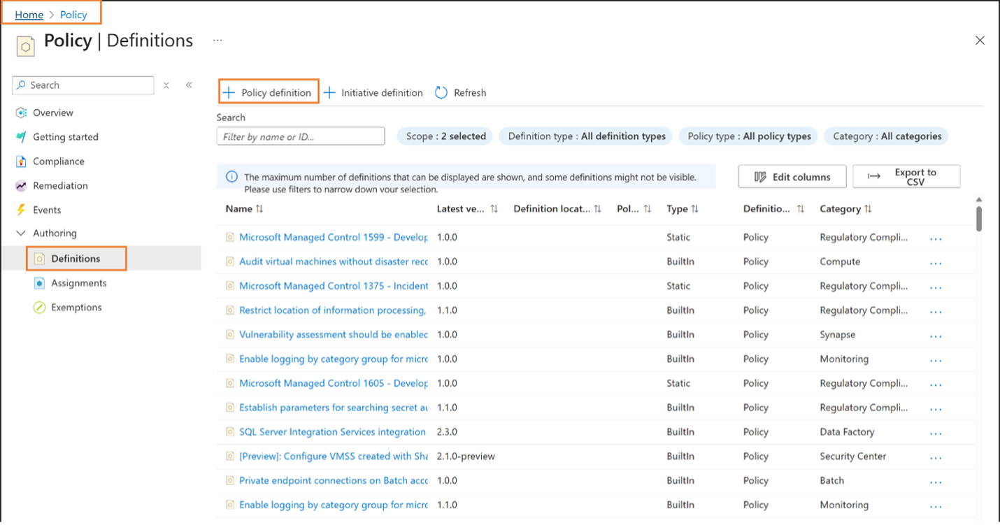
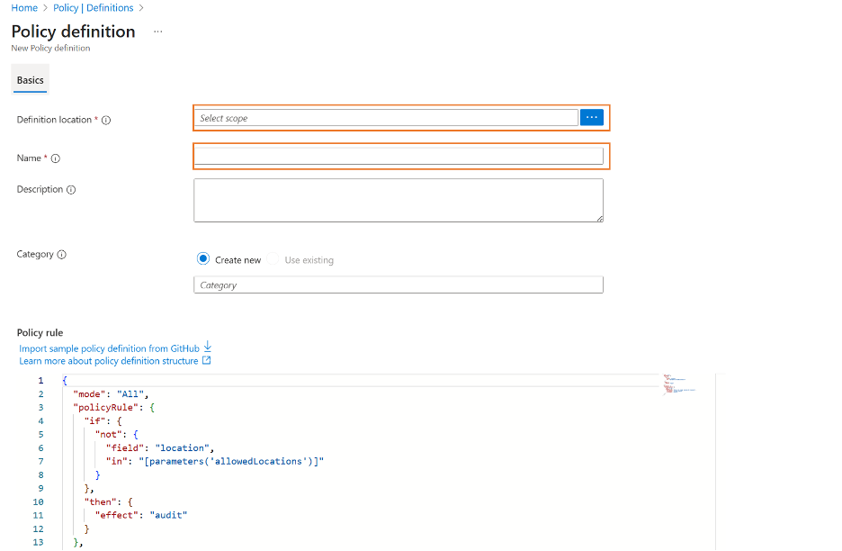
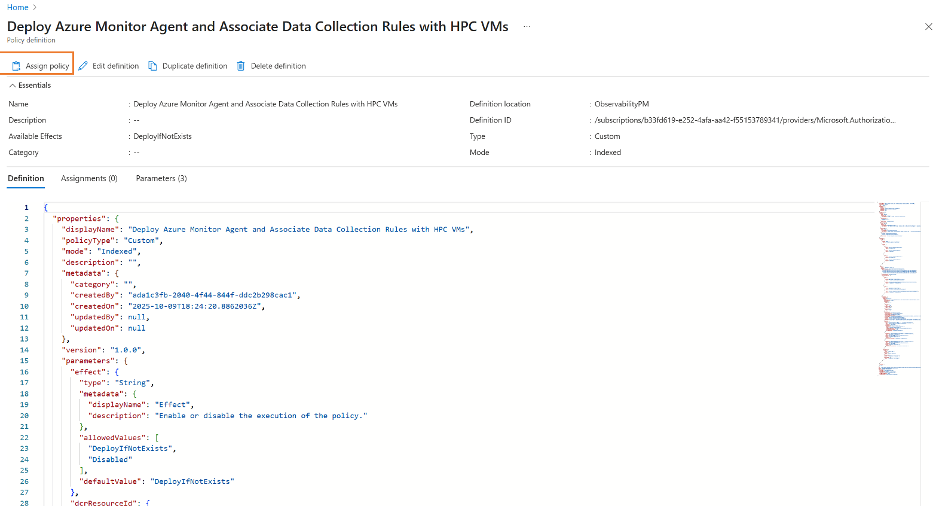
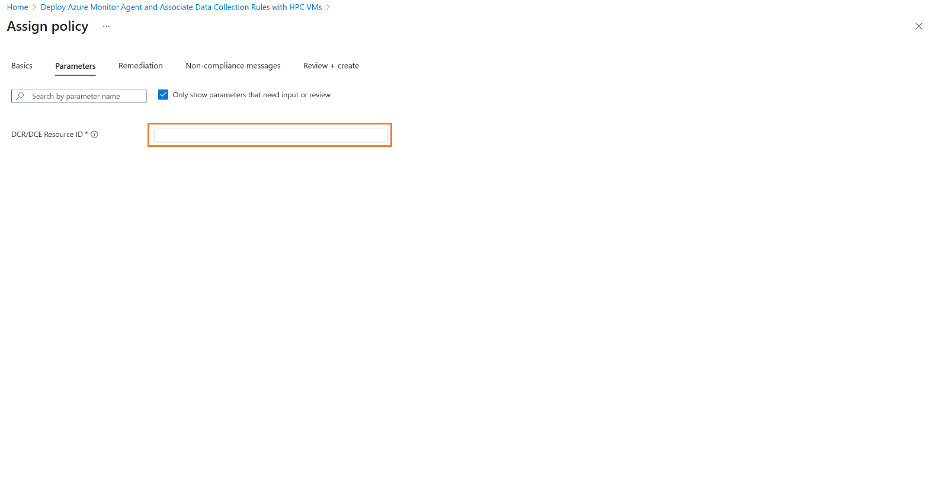
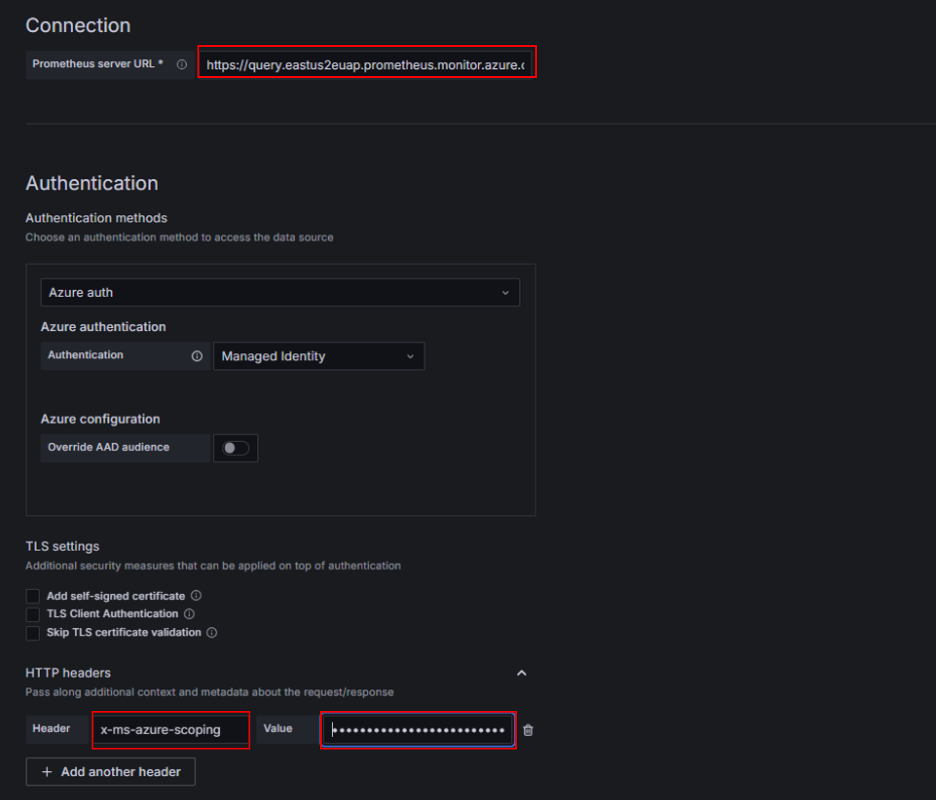
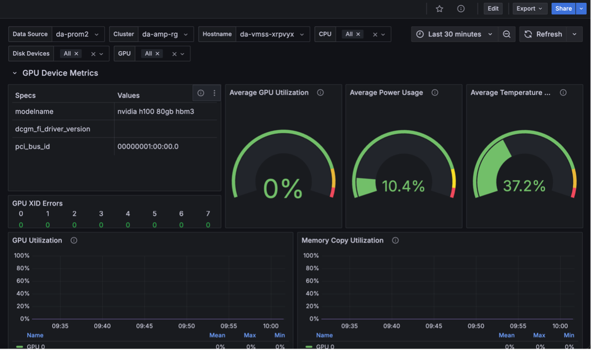
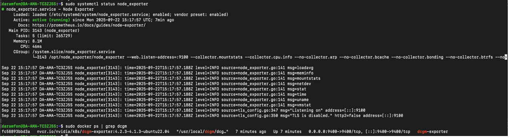

# Azure Managed Prometheus on VM/VMSS via Azure Policy

This document outlines the steps required to collect infrastructure metrics from workloads running on **N-Series** and **H-Series** VMSS clusters using **Azure Managed Prometheus** and **Azure Managed Grafana**.

---

## Prerequisites

1. **Install Azure CLI**  
   [Install Azure CLI](https://learn.microsoft.com/en-us/cli/azure/install-azure-cli?view=azure-cli-latest) on the machine where you'll run deployment/management commands(for example, your local workstation or a jumpbox VM).

2. **Required Azure Roles Assigned to User on Subscription**
   - Contributor
   - Resource Policy Contributor
   - User Access Contributor
   - Monitoring Data Reader
   - Grafana Admin

3. **Create Azure Managed Grafana Workspace using [Portal](https://learn.microsoft.com/en-us/azure/managed-grafana/quickstart-managed-grafana-portal) or [CLI](https://learn.microsoft.com/en-us/azure/managed-grafana/quickstart-managed-grafana-cli)**
   
   During creation add tag:
   ```
   DisableMicrosoftPrometheusPlugin: true
   ```

4. **[Create](https://learn.microsoft.com/en-us/azure/azure-monitor/metrics/azure-monitor-workspace-manage?tabs=azure-portal) Azure Monitor Workspace**  
   During creation add tag:
   ```
   DisableMicrosoftPrometheusPlugin: true
   ```
   Once the workspace is created:
   - Make sure to [link the Grafana workspace](https://learn.microsoft.com/en-us/azure/azure-monitor/metrics/azure-monitor-workspace-manage?tabs=azure-portal#link-a-grafana-workspace) that was created above to the Azure monitor workspace.
   - Run the command below to get the **ARM ID** of the resource. Save the output as this will be needed in the author DCR section below.

      ```bash
      az monitor account show --name <workspace-name> --resource-group <rg> --query id --output tsv
      ```

---

## Author the Data Collection Rule (DCR)
This section guides you through creating the Data Collection Rule (DCR) that configures metric collection and sends GPU/IB/node telemetry to your Azure Monitor Workspace. Update the placeholders with your workspace details before deploying the DCR.

1. Update `accountResourceId` and `location` in the [DCR JSON](../scripts/vm-vmss/dcr/sample-dcr.json). Update the `accountResourceID` in the destination section of the sample data collection rule with the Azure monitor workspace ARM ID that was saved earlier. Also update the `location` property with the location your workspace was created in (e.g. japaneast/eastus)

   ```
   {
   "properties": {
      ...
      "destinations": {
         "monitoringAccounts": [
         {
            "accountResourceId": "<YOUR-AZURE-MONITOR-WORKSPACE-ARM-ID>",
            "name": "myMonAccountDest"
         }
         ]
      },
      ...
   },
   "location": "<workspace-region>"
   }
   ```
2. Create the DCR using AzCLI. Use the `2024-03-11` API version:
   ```
   az rest --method put --url https://management.azure.com/subscriptions/<subscription-id>/resourceGroups/<resource-group>/providers/Microsoft.Insights/dataCollectionRules/<dcr-name>?api-version=2024-03-11 --body "@your_rule_file.json"
   ```

---

## Author Azure Monitor Policy

This section walks you through creating an Azure Policy that automatically installs the Azure Monitor Agent (AMA) on your HPC VMs/VMSS instances and associates them with the Data Collection Rule (DCR) you created earlier. This ensures that all the nodes created in your scale set are consistently onboarded for metric collection.

1. Go to [Portal](https://portal.azure.com) → Policy → Definitions → Policy Definition 

2.	Select the subscription, enter a policy name (for example, “Deploy Azure Monitor Agent and Associate Data Collection Rules with HPC VMs”), then paste the [Policy JSON](../scripts/vm-vmss/policy/sample-policy.json) into the policy rule section and save. 

4. Click Assign Policy. Select the subscription scope, provide the Data Collection Rule ARM ID in the parameters section, then click Review + Create.


 


---

## Deploy Your VM/VMSS

Create VMSS instance. Bash script to install DCGM and Node exporter can be found [here](../scripts/vm-vmss/exporters/install.sh). The file can be downloaded or copied and saved to your local machine. 

```bash
az vmss create   --resource-group <rg>   --name <vmss-name>   --image "microsoft-dsvm:ubuntu-hpc:2204:latest"   --vm-sku <sku>   --instance-count <count>   --admin-username <admin>   --location <region>   --public-ip-per-vm   --custom-data <install-script>
```

---

## Querying / Visualizing in Grafana
In this section, you’ll connect Grafana to Azure Managed Prometheus and import dashboards to visualize GPU, IB, and node metrics from your VM/VMSS cluster.
1. Follow these steps to create and configure a Prometheus data source in Grafana.

    - In the prometheus data source section, update the following fields:
        - For Prometheus Server URL, use this as the endpoint. Update region with Grafana instance region. 

            ```
            https://query.<REGION>.prometheus.monitor.azure.com
            ```
        - In the HTTP header section, set the `Header` key to `x-ms-azure-scoping` and the `Value` to the resource group ARM ID
            - To get the `resource group ARM ID` run the command

                ```
                az monitor account show --name <ResourceGroupName> --resource-group <resource-group-name> --query id --output tsv
                ```
        - Save and test the new data source

3. Go to Grafana → Dashboard → New → Import Dashboard
4. Download or copy the content of each of the following [dashboards](https://github.com/Azure/cyclecloud-monitoring/tree/main/infra/dashboards) into your Grafana instance. Click on Load to save 
5. In the dashboards section you can navigate to a dashboard of your choice to access GPU & Node views


## Troubleshooting
Use this section to troubleshoot missing metrics, exporter issues, or Azure Monitor ingestion problems on your VM/VMSS nodes.
SSH into one of your virtual machines and run the following checks, outputs should be similar to what is seen below:
### Check Azure Monitor Agent
```bash
journalctl -n 100 -u azureotelcollector.service
```

### Verify exporters
```bash
sudo docker ps | grep dcgm
sudo systemctl status node_exporter
```

---

## Helpful Links

- [Azure Monitor Agent (AMA) Docs](https://learn.microsoft.com/azure/azure-monitor/agents/azure-monitor-agent-overview)
- [Azure Policy Documentation](https://learn.microsoft.com/azure/governance/policy/overview)
- [VMSS Documentation](https://learn.microsoft.com/azure/virtual-machine-scale-sets/)
- [DCGM Exporter](https://github.com/NVIDIA/dcgm-exporter)
- [Prometheus Node Exporter](https://github.com/prometheus/node_exporter)
